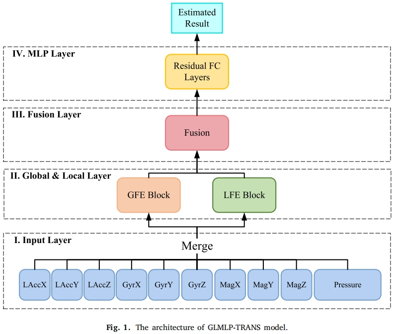

# GLMLP-TRANS: A transportation mode detection model using lightweight sensors integrated in smartphones
Official TensorFlow implementation of our paper
* **Title**: [GLMLP-TRANS: A transportation mode detection model using lightweight sensors integrated in smartphones](https://www.sciencedirect.com/science/article/abs/pii/S0140366422002535)
* **Authors**: Xuyang Liu
* **Institutes**: Hebei University of Technology <br>

## Overview
<p align="center">  </p>
In this work, we propose a novel DL framework consisting of Input Layer, Global & Local Layer, Fusion Layer and MLP Layer, using light-weight sensors integrated in mobile phones for TMD. The Framework has fewer parameters than most very deep neural networks. Also, comparing to RNN-based models, our network is featured by less training and predicting time, and may avoid overfitting to some extent. Our proposed network can capture global and local temporal features at the same time, by our proposed GFE Block and LFE Block. The former is responsible for obtaining global temporal features, which cover overall time domain features. The latter can simultaneously capture local temporal features, which cover features appearing locally. The local features take advantage of good distinguishability and resisting interference from external factors.We adopt an adaptive fusion method to combine GFE Block and LFE Block, which can not only fuse the two blocks in a balanced way, but effectively learn the significance of different features extracted by the two blocks and weigh the more important features automatically. In addition, we leverage residual techniques to accelerate the convergence rate and decrease the training time.

## Citation
Please consider citing our paper in your publications, if our findings help your research.
```bibtex
@article{liu2022glmlp,
  title={GLMLP-TRANS: A transportation mode detection model using lightweight sensors integrated in smartphones},
  author={Liu, Xuyang},
  journal={Computer Communications},
  volume={194},
  pages={156--166},
  year={2022},
  publisher={Elsevier}
}
```

## Contact
For any question about our paper or code, please contact [Xuyang Liu](liuxuyang@stu.scu.edu.cn).
